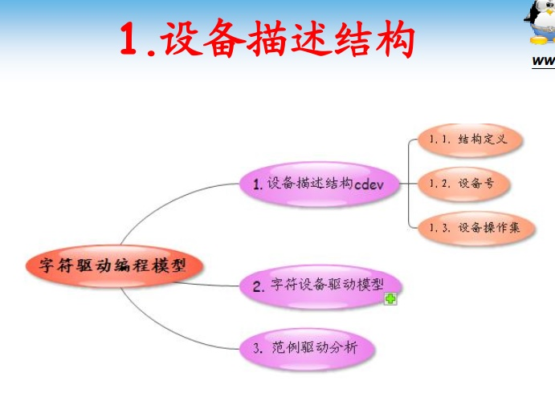
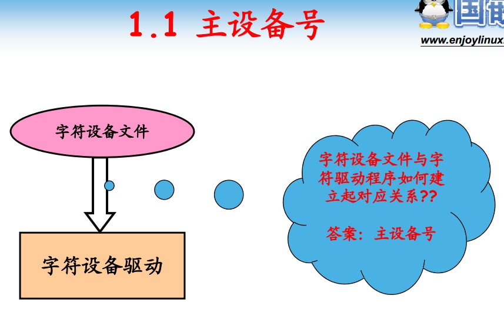
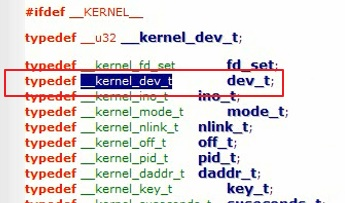
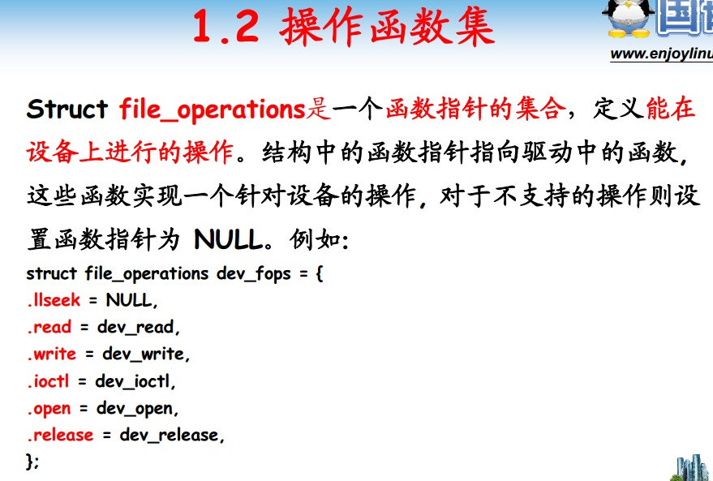
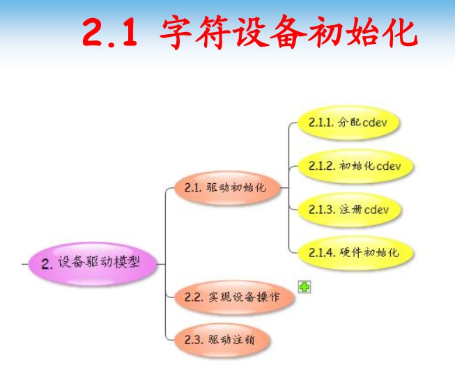
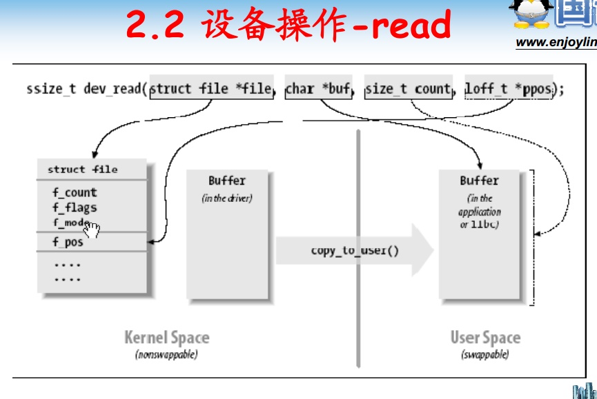
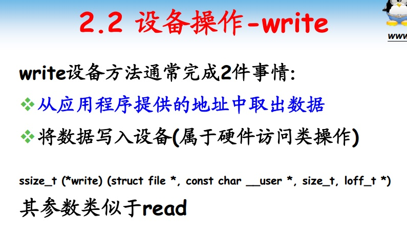

<!-- TOC depthFrom:1 depthTo:6 withLinks:1 updateOnSave:1 orderedList:0 -->

- [第15课-自己动手写驱动](#第15课-自己动手写驱动)
	- [课程索引](#课程索引)
	- [设备描述结构cdev](#设备描述结构cdev)
		- [驱动模型](#驱动模型)
		- [设备驱动描述结构](#设备驱动描述结构)
		- [设备号](#设备号)
			- [主设备号](#主设备号)
			- [次设备号](#次设备号)
			- [设备号定义](#设备号定义)
			- [设备号分配 - 静/动 alloc_chrdev_region](#设备号分配-静动-allocchrdevregion)
			- [设备号注销 unregister_chrdev_region](#设备号注销-unregisterchrdevregion)
		- [操作函数集](#操作函数集)
	- [字符设备驱动模型](#字符设备驱动模型)
		- [描述结构分配cdev_alloc](#描述结构分配cdevalloc)
		- [描述结构初始化cdev_init](#描述结构初始化cdevinit)
		- [描述结构注册cdev_add](#描述结构注册cdevadd)
		- [硬件初始化](#硬件初始化)
		- [操作函数的实现](#操作函数的实现)
		- [设备操作原型](#设备操作原型)
		- [重要结构体类型-struct file](#重要结构体类型-struct-file)
		- [重要结构体类型-struct inode](#重要结构体类型-struct-inode)
		- [open](#open)
		- [release](#release)
		- [read](#read)
		- [write](#write)
		- [驱动注销cdev_del](#驱动注销cdevdel)
	- [分析字符驱动范例程序](#分析字符驱动范例程序)
	- [总结](#总结)

<!-- /TOC -->

# 第15课-自己动手写驱动

## 课程索引


## 设备描述结构cdev



### 驱动模型


      分配
      初始化
      注册
      设备描述符结构

### 设备驱动描述结构

      任何驱动都需要在内核驱动中由一个专门结构中描述
      典型的字符设备用的struct cdev字符设备描述结构


      count：表明设备有多少个？
          同样类型的设备可以有多个
      dev_t dev：设备号

### 设备号


      逗号前是主设备号，逗号后是次设备号

#### 主设备号



      设备驱动对应数字
      字符设备对应数字
      当这两个数字相同时关联驱动，这个数字就是主设备号


#### 次设备号

      同样类型设备的区分方式


#### 设备号定义


      MKDEV：合成设备号
      MAJOR：提取主设备号
      MINOR：提取次设备号




      也就是说设备号类型其实就是一个unsigned int

#### 设备号分配 - 静/动 alloc_chrdev_region


      设备号分成两个数字合体，主设备号、次设备号
      但是主设备号分配有风险，容易冲突，那么怎么解决？
      谁最清楚设备存在？内核来解决呗，让内核帮忙选一个设备号(主设备号)，这就是动态分配


      baseminor:次设备号起始编号
      count:连续分配多少个
      name:驱动名字

#### 设备号注销 unregister_chrdev_region


### 操作函数集


      文件操作函数集非常常见


      基本成员都是函数指针
      没有close，但是有release？有read、write、open、lseek


      用户程序中的调用转换成驱动中对应的函数
      fileoperation就是充当映射关系表




      这个是GUN标准，并不是c标准 ，加点表示结构体中可以不按成员顺序初始化。


## 字符设备驱动模型



### 描述结构分配cdev_alloc


### 描述结构初始化cdev_init


### 描述结构注册cdev_add


### 硬件初始化


### 操作函数的实现


### 设备操作原型

      各个参数是固定的，因为这个函数不单单驱动实现，还需要内核调用。包括返回值也是固定的。
      了解这些操作在什么时候调用？
      需要完成什么样的工作？


### 重要结构体类型-struct file

      每个打开的文件都会关联一个struct file
      是由内核打开文件的时候创建的
      当关闭文件的时候该结构会被注销掉


      f_pos：文件位置指针。读内容的时候会自动位移。

### 重要结构体类型-struct inode

      记录文件物理上的一些信息


### open


### release


### read

      从内核空间拷贝到用户空间必须使用专门的函数




### write



### 驱动注销cdev_del


## 分析字符驱动范例程序

```
\#include <linux/module.h>
\#include <linux/types.h>
\#include <linux/fs.h>
\#include <linux/errno.h>
\#include <linux/init.h>
\#include <linux/cdev.h>
\#include <asm/uaccess.h>
\#include <linux/slab.h>


int dev1_registers[5];
int dev2_registers[5];

struct cdev cdev;
dev_t devno;

/*文件打开函数*/
int mem_open(struct inode *inode, struct file *filp)
{

    /*获取次设备号*/
    int num = MINOR(inode->i_rdev);

    if (num==0)
        filp->private_data = dev1_registers;
    else if(num == 1)
        filp->private_data = dev2_registers;
    else
        return -ENODEV;  //无效的次设备号

    return 0;
}

/*文件释放函数*/
int mem_release(struct inode *inode, struct file *filp)
{
  return 0;
}

/*读函数*/
static ssize_t mem_read(struct file *filp, char __user *buf, size_t size, loff_t *ppos)
{
  unsigned long p =  *ppos;
  unsigned int count = size;
  int ret = 0;
  int *register_addr = filp->private_data; /*获取设备的寄存器基地址*/

  /*判断读位置是否有效*/
  if (p >= 5*sizeof(int))
    return 0;
  if (count > 5*sizeof(int) - p)
    count = 5*sizeof(int) - p;

  /*读数据到用户空间*/
  if (copy_to_user(buf, register_addr+p, count))
  {
    ret = -EFAULT;
  }
  else
  {
    *ppos += count;
    ret = count;
  }

  return ret;
}

/*写函数*/
static ssize_t mem_write(struct file *filp, const char __user *buf, size_t size, loff_t *ppos)
{
  unsigned long p =  *ppos;
  unsigned int count = size;
  int ret = 0;
  int *register_addr = filp->private_data; /*获取设备的寄存器地址*/

  /*分析和获取有效的写长度*/
  if (p >= 5*sizeof(int))
    return 0;
  if (count > 5*sizeof(int) - p)
    count = 5*sizeof(int) - p;

  /*从用户空间写入数据*/
  if (copy_from_user(register_addr + p, buf, count))
    ret = -EFAULT;
  else
  {
    *ppos += count;
    ret = count;
  }

  return ret;
}

/* seek文件定位函数 */
static loff_t mem_llseek(struct file *filp, loff_t offset, int whence)
{
    loff_t newpos;

    switch(whence) {
      case SEEK_SET:
        newpos = offset;
        break;

      case SEEK_CUR:
        newpos = filp->f_pos + offset;
        break;

      case SEEK_END:
        newpos = 5*sizeof(int)-1 + offset;
        break;

      default:
        return -EINVAL;
    }
    if ((newpos<0) || (newpos>5*sizeof(int)))
    	return -EINVAL;

    filp->f_pos = newpos;
    return newpos;

}

/*文件操作结构体*/
static const struct file_operations mem_fops =
{
  .llseek = mem_llseek,
  .read = mem_read,
  .write = mem_write,
  .open = mem_open,
  .release = mem_release,
};

/*设备驱动模块加载函数*/
static int memdev_init(void)
{
  /*初始化cdev结构*/
  cdev_init(&cdev, &mem_fops);

  /* 注册字符设备 */
  alloc_chrdev_region(&devno, 0, 2, "memdev");
  cdev_add(&cdev, devno, 2);
}

/*模块卸载函数*/
static void memdev_exit(void)
{
  cdev_del(&cdev);   /*注销设备*/
  unregister_chrdev_region(devno, 2); /*释放设备号*/
}

MODULE_LICENSE("GPL");

module_init(memdev_init);
module_exit(memdev_exit);

```


## 总结
