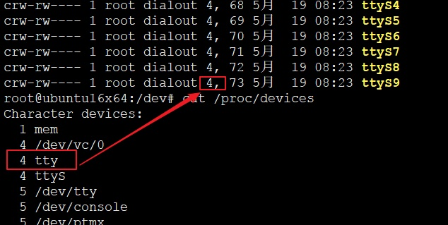
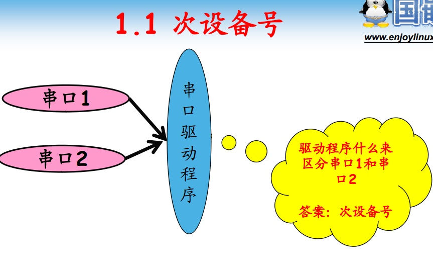
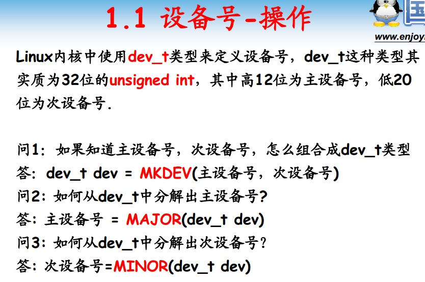
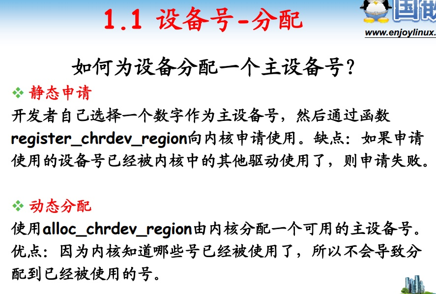
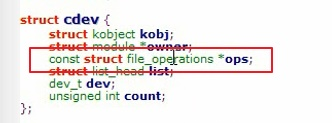
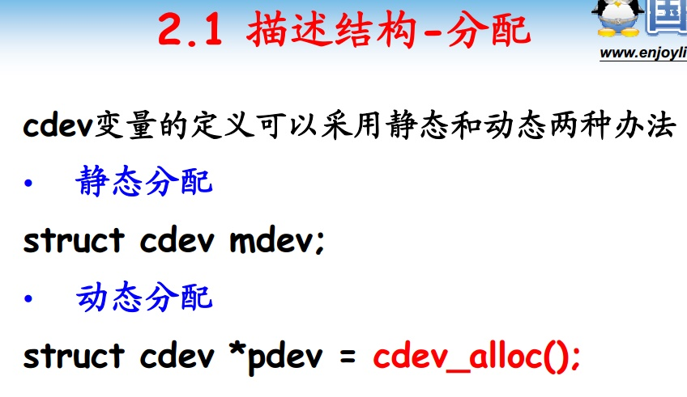
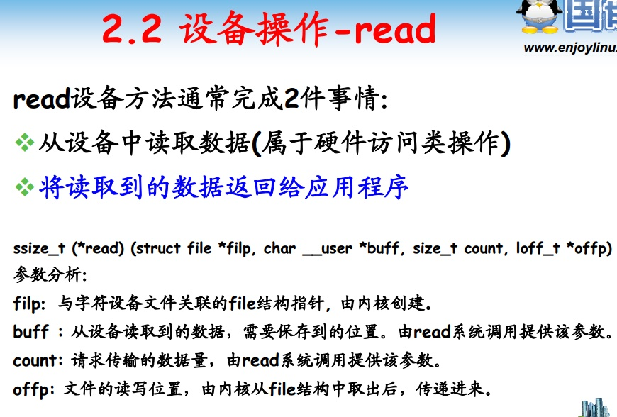

<!-- TOC depthFrom:1 depthTo:6 withLinks:1 updateOnSave:1 orderedList:0 -->

- [第15课-自己动手写驱动](#第15课-自己动手写驱动)
	- [课程索引](#课程索引)
	- [设备描述结构cdev](#设备描述结构cdev)
		- [驱动模型](#驱动模型)
		- [设备驱动描述结构](#设备驱动描述结构)
		- [设备号](#设备号)
			- [主设备号](#主设备号)
			- [次设备号](#次设备号)
			- [设备号定义](#设备号定义)
			- [设备号分配 - 静/动](#设备号分配-静动)
			- [设备号注销](#设备号注销)
		- [操作函数集](#操作函数集)
	- [字符设备驱动模型](#字符设备驱动模型)
	- [范例驱动分析](#范例驱动分析)
		- [设备操作原型](#设备操作原型)
		- [struct file](#struct-file)
		- [struct inode](#struct-inode)
		- [open](#open)
		- [release](#release)
		- [read](#read)
		- [write](#write)
		- [驱动注销](#驱动注销)
	- [总结](#总结)

<!-- /TOC -->

# 第15课-自己动手写驱动

## 课程索引

## 设备描述结构cdev

### 驱动模型

      分配
      初始化
      注册
      设备描述符结构

### 设备驱动描述结构

      任何驱动都需要在内核驱动中由一个专门结构中描述
      典型的字符设备用的struct cdev字符设备描述结构

      count：表明设备有多少个？
          同样类型的设备可以有多个
      dev_t dev：设备号

### 设备号

      逗号前是主设备号，逗号后是次设备号

#### 主设备号

      设备驱动对应数字
      字符设备对应数字
      当这两个数字相同时关联驱动，这个数字就是主设备号

#### 次设备号

      同样类型设备的区分方式

#### 设备号定义

      MKDEV：合成设备号
      MAJOR：提取主设备号
      MINOR：提取次设备号

      也就是说设备号类型其实就是一个unsigned int

#### 设备号分配 - 静/动

      设备号分成两个数字合体，主设备号、次设备号
      但是主设备号分配有风险，容易冲突，那么怎么解决？
      谁最清楚设备存在？内核来解决呗，让内核帮忙选一个设备号(主设备号)，这就是动态分配

#### 设备号注销

### 操作函数集

      文件操作函数集非常常见

      基本成员都是函数指针
      没有close，但是有release？有read、write、open、lseek

      用户程序中的调用转换成驱动中对应的函数
      fileoperation就是充当映射关系表

      这个是GUN标准，并不是c标准 ，加点表示结构体中可以不按成员顺序初始化。

## 字符设备驱动模型

## 范例驱动分析

### 设备操作原型

### struct file

### struct inode

### open

### release

### read

### write

### 驱动注销

## 总结
