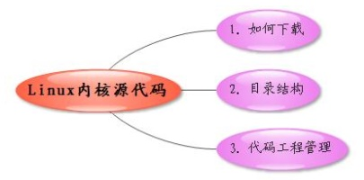
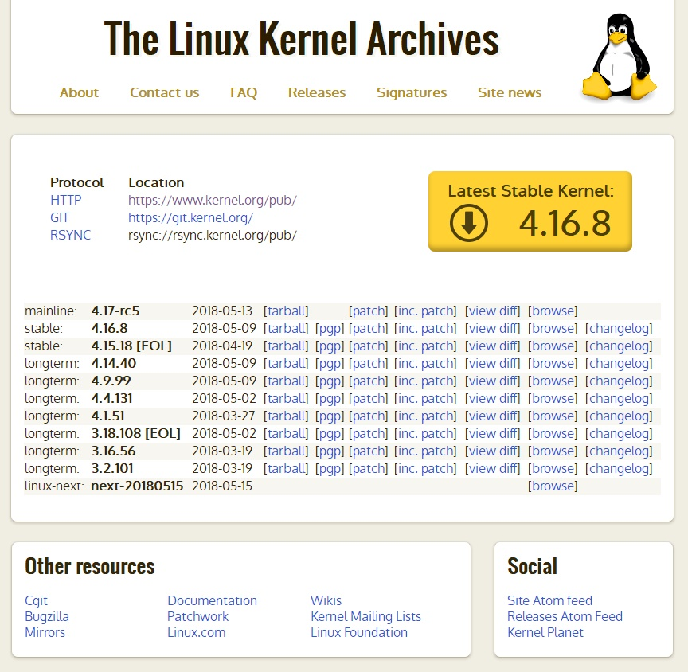
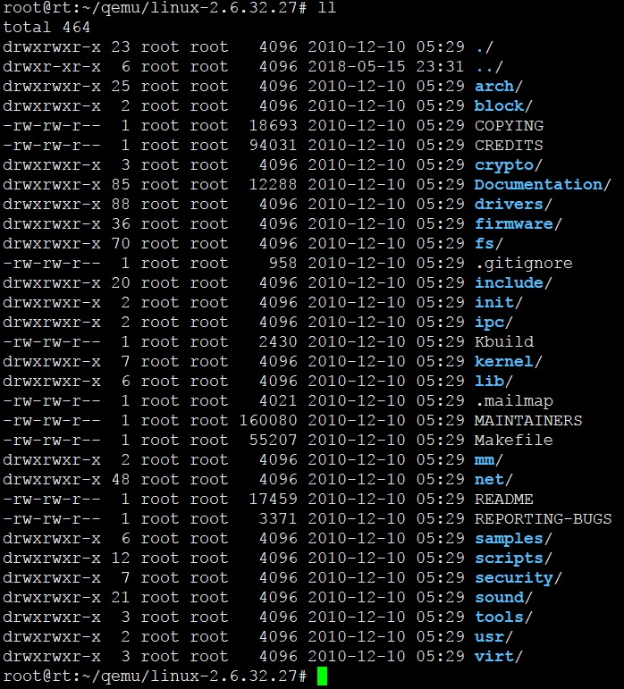
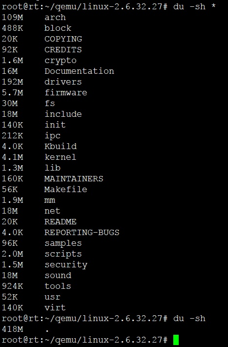
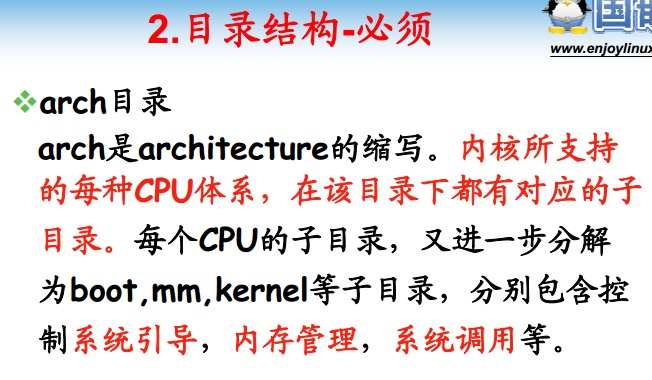
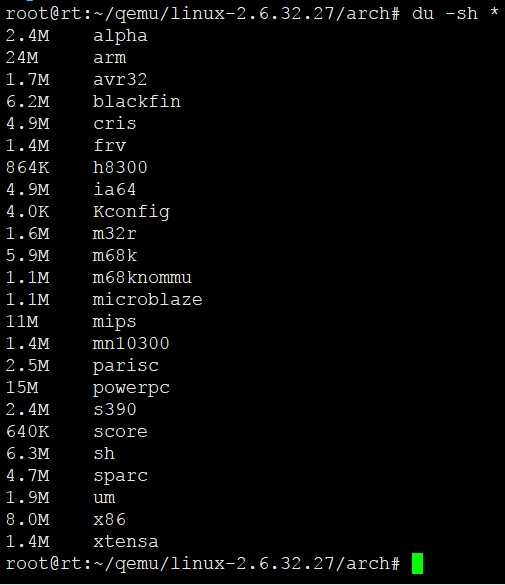
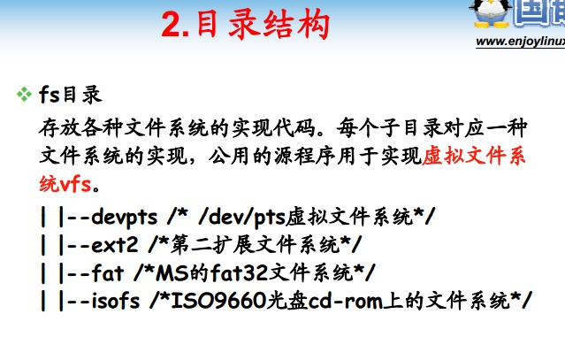
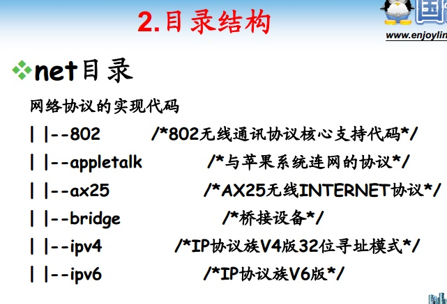

<!-- TOC depthFrom:1 depthTo:6 withLinks:1 updateOnSave:1 orderedList:0 -->

- [第3课-Linux内核内核源代码介绍](#第3课-linux内核内核源代码介绍)
	- [课程索引](#课程索引)
	- [如何获取Linux源代码](#如何获取linux源代码)
	- [内核目录结构](#内核目录结构)
		- [arch - 体系结构相关](#arch-体系结构相关)
		- [documentation、drivers、include](#documentationdriversinclude)
		- [fs - 文件系统](#fs-文件系统)
		- [net - 网络协议栈](#net-网络协议栈)
	- [代码工程管理 - 使用SourceInsight管理代码工程](#代码工程管理-使用sourceinsight管理代码工程)
	- [总结](#总结)

<!-- /TOC -->

# 第3课-Linux内核内核源代码介绍

## 课程索引

Linux内核官方网站

https://www.kernel.org/

## 如何获取Linux源代码

      不可以在Windows直接解压。因为Windows不区分大小写，而Linux区分，文件解压会出现已经包含同名文件。

## 内核目录结构

      把相同或相近的文件放到同一个目录下

      介绍几个很重要的目录

### arch - 体系结构相关

      一部分是处理器相关的代码
      一部分是开发板相关的代码

      arch子目录有包含很多个体系结构的子目录。
      每个架构子目录有区分平台通用代码和平台特殊代码(march-开头，诸如mach-s3c2440)

### documentation、drivers、include

      文档 - 代码如何使用
      驱动 - 硬件驱动
      头文件 - 所有头文件单独成立一个大的目录，其下有很多个子目录

### fs - 文件系统

### net - 网络协议栈

      每一个子目录就是一个协议的实现
      典型的IPv4、IPv6
      2.3M	ipv4
      1.3M	ipv6

## 代码工程管理 - 使用SourceInsight管理代码工程

## 总结
